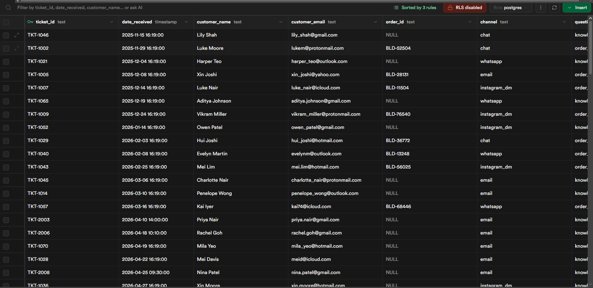
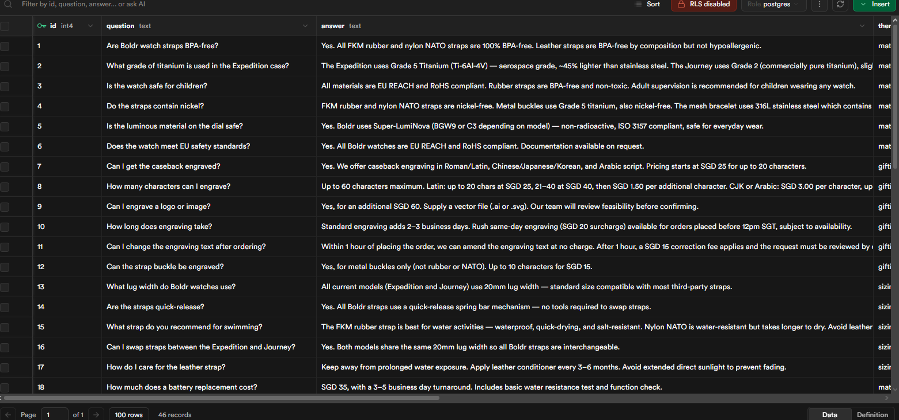
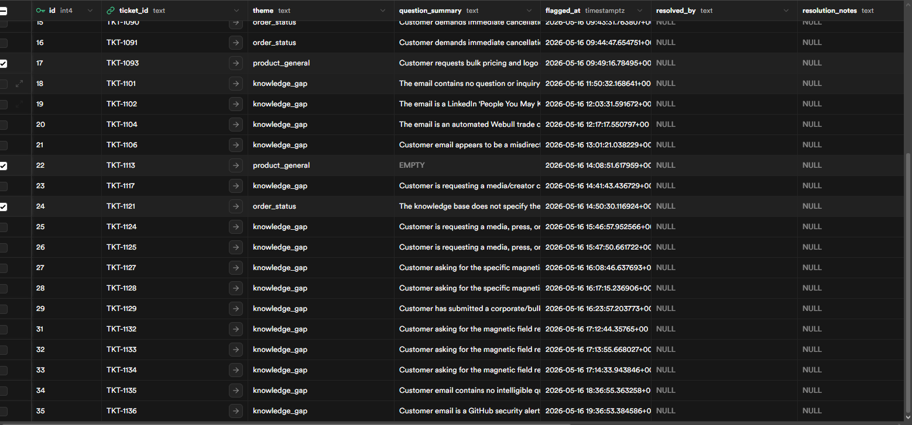

# Echelon

A self-improving customer intelligence engine built for the Echelon 2026 AI Workflow Competition (Boldr Challenge). Transforms reactive customer support into an automated system that answers enquiries, detects knowledge gaps, updates its own knowledge base, and generates marketing intelligence.

## Table of Contents

- [Business Impact](#business-impact)
- [Cost Realism](#cost-realism)
- [Safeguards](#safeguards)
- [Tech Stack](#tech-stack)
- [Architecture](#architecture)
- [Proof of Execution](#proof-of-execution)
- [Getting Started](#getting-started)
  - [Gmail](#gmail)
  - [Qwen (AI)](#qwen-ai)
  - [Telegram](#telegram)
  - [Supabase](#supabase)

---

## Business Impact

Echelon was built for the **Echelon 2026 AI Workflow Competition** (Boldr Challenge), a real brief from Boldr, a Singapore-based titanium watch micro-brand, whose 3-person customer service team was manually handling every inbound enquiry with no automation, no feedback loop, and no intelligence layer.

### The Problem It Solves

Every customer question was answered and forgotten. Novel questions, the ones that reveal what buyers actually care about, disappeared into inboxes instead of feeding back into product and marketing strategy. The knowledge base stayed static while customer needs evolved.

### What Echelon Changes

| Before | After |
|--------|-------|
| Every enquiry handled manually | AI drafts replies instantly, human approves before sending |
| Knowledge Base updated inconsistently | Gaps auto-detected and drafted for 1-click approval |
| No visibility on trending questions | Weekly theme clustering across materials, sustainability, gifting |
| Zero signal from support to marketing | Monthly marketing brief generated automatically |
| Same questions recurring | Knowledge Base self-updates to prevent repeat gaps |

### Intelligence Loop

Echelon transforms reactive support into a **self-improving engine**:

1. Ingests customer email and extracts intent
2. Searches Knowledge Base (FAQ, product specs, rate cards)
3. If answerable, drafts reply in brand voice and queues for human approval
4. If not answerable, flags gap and routes to CS staff, then auto-drafts new KB entry
5. Weekly: clusters novel questions by theme
6. Monthly: outputs a marketing brief, *"What customers are asking that isn't on your product pages"*

### Buyer Intelligence

Echelon automatically tags every enquiry against five buyer personas:

- 🟢 **Health-Conscious Buyer** -- BPA-free, nickel-free, hypoallergenic queries
- 🟡 **Gifter** -- engraving, gift wrap, seasonal campaigns
- 🔵 **Enthusiast / Collector** -- Grade 5 titanium, limited editions, craftsmanship
- 🟠 **Active / Outdoor Buyer** -- water resistance, shock, trail running
- 🟣 **Sustainability Advocate** -- vegan straps, eco packaging, carbon offset

### Why It Scales

The workflow is directly replicable across **any Shopify brand** with a considered buyer and a growing FAQ, including specialty food, cosmetics, outdoor gear, or any product category where knowledge is deep and support volume is moderate.

---

## Cost Realism

Echelon is designed to be lean. The estimated monthly running cost is **SGD $25 - $50**
for a small-scale deployment (roughly 50 customer enquiries per day), scaling up to
**SGD $100 - $200** depending on AI usage volume and infrastructure choices.

### Cost Breakdown

| Service | Cost | Notes |
|---------|------|-------|
| n8n (dedicated server) | SGD ~$24/month | Self-hosted on a dedicated server |
| Qwen Plus (AI) | ~$0.80 USD/month | At 50 messages/day, ~500 tokens in/out per message |
| Supabase | Free | Free tier is sufficient for this workload |
| Telegram | Free | Bot API is free |
| Gmail | Free | Gmail API is free |
| **Total (low usage)** | **~SGD $25 - $26/month** | At 50 messages/day |
| **Total (high usage)** | **~SGD $100 - $200/month** | As AI call volume scales up |

### How the AI Cost Was Calculated

Qwen Plus is priced at **$0.26 per million input tokens** and **$0.78 per million output tokens**.

Assuming an average of 500 input tokens and 500 output tokens per message:

- 50 messages/day x 30 days = **1,500 messages/month**
- Input: 750,000 tokens x $0.26/1M = **~$0.20**
- Output: 750,000 tokens x $0.78/1M = **~$0.59**
- **Total AI cost: ~$0.80 USD/month at base volume**

AI costs scale linearly, so at 500 messages/day the AI cost would be roughly **$8 USD/month**,
still very affordable. The $100 - $200/month ceiling accounts for high message volumes,
longer prompts with full knowledge base context injected, and potential Supabase Pro
upgrades ($25 USD/month) if the free tier limits are exceeded.

### Why This Stack Is Cost-Efficient

- **Supabase free tier** covers up to 500MB database and 50,000 monthly active users, more than enough for a 3-person CS team
- **Qwen Plus** is significantly cheaper than GPT-4o or Claude at comparable performance
- **Telegram and Gmail APIs** are both completely free
- The only fixed cost is the **n8n dedicated server** at SGD $24/month, which gives full control, no workflow limits, and no per-execution fees

---

## Safeguards

Echelon is built with a human-in-the-loop approach at every critical step. The AI never acts alone on anything customer-facing or knowledge-critical.

### Email Approval via Telegram

Every AI-drafted reply is sent to the team via **Telegram for approval before anything is sent**. Staff can review the full email content and confirm it is correct. This catches any AI errors, off-brand phrasing, or incorrect information before it reaches the customer.

### No Knowledge? No Guessing.

If the AI cannot find a relevant answer in the knowledge base, it **does not hallucinate or make up a response**. Instead it:

1. Sends an email to the respective person responsible for that topic
2. Waits for them to respond with the correct answer
3. Uses that human-provided answer to draft the reply

### Knowledge Base Gate

Once a knowledge gap has been resolved, the system checks with the **team lead** on whether the new information should be added to the knowledge base permanently. The lead can either:

- **Approve** -- the entry is added to the knowledge base for future use
- **Reject** -- the entry is deleted from the knowledge gaps table and not retained

This ensures the knowledge base only grows with verified, intentional information and never accumulates noise or one-off answers that should not be reused.

---

## Tech Stack

| Layer | Technology | Reason |
|-------|-----------|--------|
| Database | Supabase (PostgreSQL) | Dedicated DB for low latency and fast SQL search |
| AI | Qwen Plus | Fast AI inference for processing and responses |
| Automation | n8n | Underlying workflow orchestration |
| Customer Comms | Gmail | Email communication with customers and team |
| Staff Approvals | Telegram | Quick approval workflows for internal staff |

---

## Architecture

Echelon is built on n8n as its automation backbone, connecting:

- **Supabase** -- stores and retrieves data with the speed and flexibility of SQL
- **Qwen Plus** -- handles AI-powered processing within workflows
- **Gmail** -- manages outbound communication to customers and the team
- **Telegram** -- enables staff to approve or action requests on the go

---

## Proof of Execution

The following screenshots show the live Supabase database powering Echelon in production.

### Tickets Table
Real inbound customer tickets ingested and stored, including ticket ID, date received, customer name, email, order ID, and channel (email, WhatsApp, Instagram DM, chat).

### Knowledge Base Table
46 live knowledge base entries covering materials, engraving, sizing, servicing, and more -- each with a question and a verified answer ready for AI retrieval.

### Knowledge Gaps Table
Unresolved or flagged tickets tracked in real time, with theme classification, question summary, flagged timestamp, and resolution status -- feeding directly into the approval and KB update workflow.

---

## Getting Started

### Gmail
Add your own Gmail credentials via the [Google API Library](https://console.cloud.google.com/apis/library).
Enable the Gmail API, create OAuth 2.0 credentials, and add them to your n8n Gmail nodes.

### Qwen (AI)
The existing HTTP requests in the workflows have been altered and will not work out of the box.
Get your own API key from [Qwen](https://dashscope.aliyun.com/) and replace it in the relevant n8n HTTP Request nodes.

### Telegram
You can either:
- **Use your own bot** -- create one via [@BotFather](https://t.me/botfather) on Telegram, grab the bot token, and add it to the n8n Telegram nodes. Make sure to also update the **chat ID** to your own individual chat ID.
- **Use the existing bot** -- contact [melsonwang@gmail.com](mailto:melsonwang@gmail.com) to request access.

### Supabase
Create a project at [supabase.com](https://supabase.com), copy your project URL and anon/service key, and add them to the n8n Supabase nodes.
